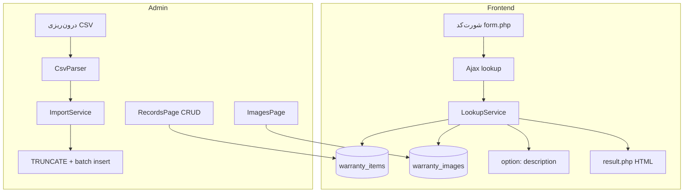

# Apple Warranty Inquiry — دانشنامه پلاگین

> **مرجع اصلی پروژه** · مناسب Git، مدیر وردپرس و توسعه‌دهنده  
> آخرین به‌روزرسانی سند: **2026-05** · نسخهٔ محصول: **1.1.4**

| مشخصه | مقدار |
|--------|--------|
| Slug پلاگین | `apple-warranty-inquiry` |
| Namespace | `AppleWarranty` |
| Text domain | `apple-warranty-inquiry` |
| شورت‌کد | `[apple_warranty_inquiry]` |
| نویسنده | Payam Ava - Heydaripour |
| مسیر نصب | `wp-content/plugins/apple-warranty-inquiry/` |

**ورودی سریع Git:** [README.md](./README.md)

---

## فهرست

### بخش الف — مدیر سایت (وردپرس)
1. [هدف و خلاصه](#۱-هدف-و-خلاصه)
2. [نصب و راه‌اندازی اولیه](#۲-نصب-و-راه‌اندازی-اولیه)
3. [گردش کار پیشنهادی](#۳-گردش-کار-پیشنهادی)
4. [پنل «گارانتی اپل»](#۴-پنل-گارانتی-اپل)
5. [درون‌ریزی CSV](#۵-درون‌ریزی-csv)
6. [شورت‌کد و صفحه عمومی](#۶-شورت‌کد-و-صفحه-عمومی)
7. [کش و عملکرد](#۷-کش-و-عملکرد)
8. [عیب‌یابی برای مدیر](#۸-عیب‌یابی-برای-مدیر)

### بخش ب — توسعه‌دهنده
9. [پیش‌نیازها و Constants](#۹-پیش‌نیازها-و-constants)
10. [ساختار فایل‌ها](#۱۰-ساختار-فایل‌ها)
11. [معماری و لایه‌ها](#۱۱-معماری-و-لایه‌ها)
12. [دیتابیس](#۱۲-دیتابیس)
13. [فرانت‌اند و Ajax](#۱۳-فرانت‌اند-و-ajax)
14. [امنیت](#۱۴-امنیت)
15. [درون‌ریزی (فنی)](#۱۵-درون‌ریزی-فنی)
16. [Assets و قالب‌ها](#۱۶-assets-و-قالب‌ها)
17. [Hooks توسعه](#۱۷-hooks-توسعه)
18. [استقرار و تست](#۱۸-استقرار-و-تست)
19. [محدودیت‌ها و بدهی فنی](#۱۹-محدودیت‌ها-و-بدهی-فنی)
20. [تاریخچه نسخه](#۲۰-تاریخچه-نسخه)
21. [نقشه جریان داده](#۲۱-نقشه-جریان-داده)

---

# بخش الف — مدیر سایت

## ۱. هدف و خلاصه

این پلاگین به بازدیدکننده اجازه می‌دهد با وارد کردن **شماره سریال** و **کد امنیتی**، اطلاعات گارانتی ثبت‌شده را ببیند (نام محصول، تاریخ‌ها، نوع گارانتی، تصویر، متن توضیحات).

ویژگی‌های کلیدی برای مدیر:

- مدیریت سریال‌ها از پیشخوان (افزودن، ویرایش، حذف، جستجو)
- **درون‌ریزی** انبوه از فایل CSV (جایگزینی کامل داده‌ها)
- نگاشت **شناسه تصویر** به تصاویر کتابخانه رسانه
- متن HTML ثابت زیر نتیجه استعلام + لینک راهنمای پیدا کردن سریال

داده‌های گارانتی در **جداول اختصاصی دیتابیس** ذخیره می‌شوند (نه برگه/نوشته وردپرس).

---

## ۲. نصب و راه‌اندازی اولیه

### نصب

1. پوشه `apple-warranty-inquiry` را در `wp-content/plugins/` کپی کنید.
2. **افزونه‌ها → فعال‌سازی**.
3. پس از فعال‌سازی، جداول `{prefix}warranty_items` و `{prefix}warranty_images` ساخته می‌شوند.

### بروزرسانی

- Overwrite پوشه پلاگین کافی است؛ دادهٔ جداول حفظ می‌شود.
- پس از تغییر CSS/JS فرانت، کش سایت (LiteSpeed و مشابه) را پاک کنید.

### پیش‌نیاز سرور

| مورد | حداقل |
|------|--------|
| PHP | 8.0 |
| WordPress | 6.0 |
| افزونه PHP **GD** | برای تصویر کپچا |

---

## ۳. گردش کار پیشنهادی

```
۱) تصاویر محصول     → ثبت image_key + انتخاب تصویر از رسانه
۲) درون‌ریزی CSV    → آپلود فایل، پیش‌نمایش، تأیید، درون‌ریزی نهایی
   (یا افزودن دستی از «شماره سریال‌ها»)
۳) تنظیمات          → متن HTML توضیحات + لینک راهنمای سریال (اختیاری)
۴) برگه سایت        → قرار دادن شورت‌کد [apple_warranty_inquiry]
۵) کش               → مستثنی کردن همان برگه از Full Page Cache
```

**ترتیب مهم:** قبل از درون‌ریزی، `image_key`‌های استفاده‌شده در CSV باید در **تصاویر محصول** از قبل وجود داشته باشند؛ وگرنه آن ردیف‌ها رد می‌شوند.

---

## ۴. پنل «گارانتی اپل»

منوی اصلی در پیشخوان با آیکون اپل. دسترسی: کاربران با قابلیت `manage_options` (معمولاً مدیر).

| زیرمنو | کاربرد |
|--------|--------|
| **شماره سریال‌ها** | لیست، جستجو، افزودن/ویرایش/حذف تکی و گروهی |
| **تصاویر محصول** | نگاشت `image_key` → تصویر رسانه |
| **درون‌ریزی** | آپلود CSV، پیش‌نمایش، جایگزینی کامل داده‌ها |
| **تنظیمات** | متن HTML زیر نتیجه + URL راهنمای سریال |

### شماره سریال‌ها

- بالای صفحه: **باکس شورت‌کد** با دکمه کپی.
- در جدول: **کلیک روی شماره سریال** یا **شناسه تصویر** → کپی در کلیپبورد + بازخورد «کپی شد!» (همان رفتار صفحه تصاویر).
- جدول با صفحه‌بندی استاندارد (مشابه لیست نوشته‌ها).
- در حالت افزودن/ویرایش، فرم در بالا و جدول لیست همچنان پایین نمایش داده می‌شود (عمدی).

### تصاویر محصول

- **شناسه تصویر (`image_key`):** فقط حروف انگلیسی/slug (مثال: `iphone-16-pro-max`).
- **عنوان:** فارسی برای نمایش.
- **تصویر:** از کتابخانه رسانه وردپرس.

این شناسه در CSV و در هر رکورد سریال استفاده می‌شود.

- در لیست تصاویر: **کلیک روی شناسه** → کپی در کلیپبورد.

### تنظیمات

- **توضیحات گارانتی:** ویرایشگر HTML — در پایین هر نتیجه استعلام موفق نمایش داده می‌شود.
- **لینک راهنمای سریال:** اگر پر شود، زیر دکمه استعلام لینک «چگونه شماره سریال…» نشان داده می‌شود.

---

## ۵. درون‌ریزی CSV

### مراحل در پیشخوان

1. **دانلود فایل نمونه** — از باکس راهنما (فایل ثابت داخل پلاگین).
2. **انتخاب فایل CSV** → **نمایش پیش‌نمایش** (۱۰ ردیف اول).
3. بررسی جدول پیش‌نمایش.
4. تیک تأیید جایگزینی کامل → **شروع درون‌ریزی**.

هنگام ارسال فرم، **لودینگ** روی پنل نمایش داده می‌شود تا صفحه بارگذاری شود.

### فایل نمونه

| مسیر | توضیح |
|------|--------|
| `assets/samples/warranty-sample.csv` | همان فایلی که دکمه دانلود می‌فرستد |
| `assets/samples/README.txt` | راهنمای ویرایش نمونه |

برای تغییر نمونه: فایل را در Excel/LibreOffice باز کنید و با **CSV UTF-8** ذخیره کنید.

### ستون‌های الزامی (ترتیب ثابت)

```text
serial_number,product_name,image_key,warranty_type,start_date,end_date
```

| ستون | توضیح |
|------|--------|
| serial_number | شماره سریال (هر فرمتی؛ هنگام جستجو نرمال می‌شود) |
| product_name | نام محصول (فارسی مجاز) |
| image_key | شناسه تصویر — باید در «تصاویر محصول» وجود داشته باشد؛ خالی = بدون تصویر |
| warranty_type | متن آزاد (مثلاً «گارانتی ۱۸ ماهه \| ۱ سال خدمات نرم‌افزاری») |
| start_date / end_date | `2025-03-01` یا فرمت اکسل `3/1/2025` |

### قوانین مهم

- فایل **UTF-8** (BOM در نمونه وجود دارد — برای Excel فارسی مناسب است).
- هر درون‌ریزی موفق = **حذف کامل** سریال‌های قبلی + درج دادهٔ جدید (جایگزینی، نه ادغام).
- `image_key` نامعتبر → **آن ردیف رد** می‌شود؛ بقیه ادامه پیدا می‌کنند.
- سریال تکراری در یک فایل → ردیف دوم ممکن است در دیتابیس ثبت نشود (محدودیت UNIQUE).

---

## ۶. شورت‌کد و صفحه عمومی

### قرار دادن در برگه

```
[apple_warranty_inquiry]
```

در **شماره سریال‌ها** باکس کپی شورت‌کد وجود دارد.

### تجربه کاربر

1. وارد کردن کد امنیتی (تصویر) + شماره سریال.
2. دکمه **بررسی شناسه**.
3. نمایش کارت نتیجه (محصول، سریال، تاریخ‌ها، گارانتی، توضیحات).
4. تا **لود کامل تصویر محصول**، باکس نتیجه در حالت لودینگ می‌ماند (جلوگیری از پرش layout).

### فایل ثابت آیکون گارانتی (اختیاری)

| مسیر | فرمت |
|------|------|
| `assets/images/warranty-badge.webp` | WebP — کنار عنوان نوع گارانتی در نتیجه |

جزئیات: [assets/images/README.txt](./assets/images/README.txt)

---

## ۷. کش و عملکرد

- صفحه‌ای که شورت‌کد دارد را از **LiteSpeed Cache → Full Page Cache** (یا معادل) **مستثنی** کنید.
- در غیر این صورت فرم Ajax / کپچا ممکن است خراب یا قدیمی شود.
- پس از deploy استایل: کش CDN/هاست را پاک کنید.

---

## ۸. عیب‌یابی برای مدیر

| مشکل | راه‌حل احتمالی |
|------|----------------|
| شورت‌کد خام / بدون استایل | کش صفحه؛ بررسی بارگذاری `frontend.min.css` |
| کپچا نمایش داده نمی‌شود | فعال بودن GD روی PHP |
| «شناسه یافت نشد» | سریال در لیست نیست؛ فاصله/خط تیره در ورودی کاربر مهم نیست (نرمال می‌شود) |
| درون‌ریزی؛ ردیف‌های زیاد رد شدند | `image_key` را در «تصاویر محصول» بسازید |
| دانلود نمونه CSV خراب بود | در نسخه‌های قدیمی HTML داخل فایل بود — در نسخه فعلی فایل ثابت از `assets/samples/` ارسال می‌شود |
| نتیجه پرش می‌کند | نسخه فعلی تا لود تصویر لودینگ دارد؛ کش JS قدیمی را پاک کنید |

---

# بخش ب — توسعه‌دهنده

## ۹. پیش‌نیازها و Constants

```php
// plugin.php — نسخه محصول (همه باید 1.1.4 باشند)
// * Version:           1.1.4   (هدر فایل پلاگین)
// * APPLE_WARRANTY_VERSION
// * readme.txt → Stable tag
APPLE_WARRANTY_VERSION      // '1.1.4' — cache-bust دارایی‌های CSS/JS
APPLE_WARRANTY_PLUGIN_FILE
APPLE_WARRANTY_PLUGIN_DIR
APPLE_WARRANTY_PLUGIN_URL
APPLE_WARRANTY_DB_VERSION   // '1.0.0' — فقط نسخه schema دیتابیس (جدا از نسخه پلاگین)
```

Autoload: `app/Autoloader.php` (PSR-4 به `app/`) — **بدون Composer**.

Bootstrap: `Plugin::instance()->init()` روی `plugins_loaded`.

---

## ۱۰. ساختار فایل‌ها

```
apple-warranty-inquiry/
├── README.md                    # ورودی Git
├── HANDOFF.md                   # همین دانشنامه
├── readme.txt                   # WordPress plugin directory meta
├── .gitignore
├── plugin.php
├── index.php
├── app/
│   ├── Autoloader.php
│   ├── Plugin.php
│   ├── Admin/
│   │   ├── Menu.php             # منو + enqueue شرطی assets
│   │   ├── RecordsPage.php
│   │   ├── ImagesPage.php
│   │   ├── ImportPage.php       # درون‌ریزی + دانلود نمونه در admin_init
│   │   └── SettingsPage.php
│   ├── Ajax/
│   │   ├── LookupHandler.php
│   │   └── CaptchaHandler.php
│   ├── Database/
│   │   ├── Schema.php
│   │   └── Installer.php
│   ├── Frontend/
│   │   └── Shortcode.php        # TAG = apple_warranty_inquiry
│   ├── Helpers/
│   │   ├── SerialNormalizer.php
│   │   ├── PersianDigits.php
│   │   ├── DateFormatter.php
│   │   ├── DateNormalizer.php
│   │   └── AdminPagination.php
│   ├── Import/
│   │   ├── CsvParser.php
│   │   └── CsvValidator.php
│   ├── Models/
│   │   ├── WarrantyItem.php
│   │   └── WarrantyImage.php
│   ├── Repositories/
│   │   ├── WarrantyItemRepository.php
│   │   └── WarrantyImageRepository.php
│   └── Services/
│       ├── LookupService.php
│       ├── ImportService.php
│       ├── CaptchaService.php
│       └── RateLimiter.php
├── assets/
│   ├── css/
│   │   ├── frontend.scss        # منبع استایل فرانت
│   │   ├── frontend.min.css     # enqueue در production
│   │   ├── admin.css            # رکوردها + تصاویر
│   │   └── admin-import.css     # فقط صفحه درون‌ریزی
│   ├── js/
│   │   ├── frontend.js
│   │   ├── admin-records.js
│   │   ├── admin-images.js
│   │   ├── admin-import.js
│   │   └── admin.js             # deprecated — مرجع خالی
│   ├── samples/
│   │   └── warranty-sample.csv
│   └── images/
│       └── warranty-badge.webp  # آپلود توسط شما (اختیاری)
└── templates/
    ├── form.php
    ├── result.php
    └── admin/
        ├── records.php
        ├── shortcode-notice.php
        ├── images.php
        ├── import.php
        └── settings.php
```

---

## ۱۱. معماری و لایه‌ها

```
Controller (thin)     Admin/*Page, Ajax/*Handler, Frontend/Shortcode
        ↓
Service               LookupService, ImportService, CaptchaService, RateLimiter
        ↓
Repository            WarrantyItemRepository, WarrantyImageRepository
        ↓
Database              جداول اختصاصی {prefix}warranty_*
```

### قوانین معماری (ثابت)

1. **OOP + Namespace** — یک کلاس، یک مسئولیت تقریبی.
2. **هرگز** `WP_Query` / `post_meta` برای رکورد گارانتی استفاده نشود.
3. **warranty_type** = یک ستون متن آزاد (نه جدول جدا).
4. **سریال:** نرمال‌سازی بدون محدودیت طول در validation (محدودیت DB: `varchar(191)`).
5. **فرانت:** استایل فقط فرم/نتیجه؛ تایپوگرافی از قالب.
6. همهٔ queryهای دیتابیس: **prepared statements** در Repository.

### Menu.php — باگ تاریخی

`add_submenu_page` برای slug `apple-warranty` **نباید callback جدا** داشته باشد؛ فقط `add_menu_page` callback دارد. وگرنه صفحه دو بار render می‌شود.

### Enqueue ادمین (فقط صفحه مربوط)

| Hook صفحه | CSS | JS |
|-----------|-----|-----|
| `toplevel_page_apple-warranty` | admin.css | admin-records.js |
| `apple-warranty_page_apple-warranty-images` | admin.css + media | admin-images.js |
| `apple-warranty_page_apple-warranty-import` | admin-import.css | admin-import.js |
| تنظیمات | — | — |

---

## ۱۲. دیتابیس

### `{prefix}warranty_items`

| فیلد | نوع | توضیح |
|------|-----|--------|
| id | bigint PK | |
| serial_number | varchar(191) | همان‌طور که وارد شده |
| normalized_serial | varchar(191) UNIQUE | فقط روی این جستجو می‌شود |
| product_name | varchar(255) | |
| image_key | varchar(100) | |
| warranty_type | varchar(500) | متن کامل |
| start_date, end_date | varchar(10) | `YYYY-MM-DD` |
| created_at | datetime | |

### `{prefix}warranty_images`

| فیلد | توضیح |
|------|--------|
| image_key | UNIQUE slug |
| title | عنوان فارسی |
| attachment_id | ID رسانه |

### Options

| option | کاربرد |
|--------|--------|
| `apple_warranty_description` | HTML زیر نتیجه (`wp_kses_post`) |
| `apple_warranty_serial_help_url` | URL اختیاری |
| `apple_warranty_db_version` | نسخه schema |

### SerialNormalizer

- uppercase
- حذف فاصله، `-`, `_`, `–`, `—`
- فقط `A-Z0-9`
- بدون اعتبارسنجی طول ثابت (عمدی)

### DateFormatter / DateNormalizer

- **ذخیره:** میلادی `YYYY-MM-DD`
- **نمایش:** `YYYY/MM/DD` با **ارقام فارسی** (بدون تبدیل تقویم شمسی)
- **Import:** `3/1/2025` یا `2025-03-01` → `DateNormalizer`

---

## ۱۳. فرانت‌اند و Ajax

### شورت‌کد

- ثابت: `AppleWarranty\Frontend\Shortcode::TAG` → `apple_warranty_inquiry`
- دارایی‌ها: `wp_enqueue` در `Shortcode::render()` — `frontend.min.css` + `frontend.js`

### Ajax (`admin-ajax.php`)

| action | nopriv | توضیح |
|--------|--------|--------|
| `apple_warranty_lookup` | بله | استعلام → JSON `{ success, data: { html, data } }` |
| `apple_warranty_captcha_refresh` | بله | token + image_url |
| `apple_warranty_captcha_image` | بله | PNG (بدون nonce؛ با token) |

**Nonce:** `apple_warranty_frontend` — localized در `appleWarranty.nonce`

### LookupService

1. `SerialNormalizer::normalize`
2. `WarrantyItemRepository::find_by_normalized_serial`
3. `WarrantyImageRepository::find_by_key` (در صورت image_key)
4. `get_option('apple_warranty_description')`
5. `templates/result.php` → HTML در پاسخ Ajax

### frontend.js — لودینگ نتیجه

- پیش‌بارگذاری تصویر محصول با `new Image()`
- کلاس `awi-result-wrap--loading` تا اتمام لود
- اسکرول به نتیجه **بعد از** لود تصویر

---

## ۱۴. امنیت

| لایه | پیاده‌سازی |
|------|------------|
| ادمین | `manage_options` + nonce هر فرم |
| Ajax | `check_ajax_referer` |
| SQL | `$wpdb->prepare` در Repository |
| خروجی | `esc_*` در template؛ `wp_kses_post` برای HTML تنظیمات |
| Captcha | transient یک‌بارمصرف؛ `hash_equals` |
| Rate limit | 10 درخواست / 5 دقیقه per IP+UA (`RateLimiter`) |
| آپلود CSV | `wp_handle_upload` + فقط پسوند csv |

---

## ۱۵. درون‌ریزی (فنی)

### جریان

```
CsvParser::parse → CsvValidator::validate_header
→ validate_row (per line) → ImportService::import
→ START TRANSACTION → truncate → insert_batch → COMMIT
```

### دانلود نمونه CSV

- **مهم:** در `admin_init` (قبل از HTML)، نه داخل `render()`.
- فایل: `ImportPage::SAMPLE_CSV_FILE` → `readfile()` + headers.
- کلاس: `ImportPage::register_hooks()` از `Menu::register()`.

### نکات پیاده‌سازی

- `TRUNCATE` در MySQL ممکن است commit ضمنی بزند — تراکنش کامل اتمیک نیست؛ در صورت نیاز آینده: `DELETE` به‌جای `TRUNCATE`.
- `insert_batch`: chunk 100؛ duplicate UNIQUE → insert ناموفق بدون پیام شفاف در ادمین دستی.
- فایل preview موقت: transient `apple_warranty_import_file` (۱ ساعت).

---

## ۱۶. Assets و قالب‌ها

### فرانت CSS

| فایل | نقش |
|------|-----|
| `frontend.scss` | منبع توسعه |
| `frontend.min.css` | **enqueue** (`Plugin::register_frontend_assets`) |

پس از تغییر SCSS حتماً کامپایل و commit کنید (یا در CI).

### قالب‌ها

- `form.php` — فرم + `#awi-result` خالی برای Ajax
- `result.php` — partial HTML؛ شامل slot تصویر + badge گارانتی

---

## ۱۷. Hooks توسعه

```php
// فیلتر دادهٔ نمایش پس از lookup
apply_filters( 'apple_warranty/lookup_result', $data, $item );

// اکشن پس از lookup موفق
do_action( 'apple_warranty/after_lookup', $item, $normalized_serial );
```

افزودن REST API، WooCommerce، وضعیت گارانتی و غیره ترجیحاً از همین نقاط یا Service/Repository جدید — **بدون** post type.

---

## ۱۸. استقرار و تست

### چک‌لیست QA

- [ ] فعال‌سازی → جداول ساخته شوند
- [ ] تصویر محصول + image_key
- [ ] دانلود نمونه CSV → فایل معتبر UTF-8
- [ ] درون‌ریزی: preview → confirm → تعداد inserted
- [ ] تنظیمات HTML + لینک راهنما
- [ ] شورت‌کد: captcha، lookup موفق/ناموفق، rate limit
- [ ] لودینگ نتیجه تا لود تصویر
- [ ] کش: صفحه شورت‌کد exclude از FPC

### Git

- `README.md` + `HANDOFF.md` را در repo نگه دارید.
- `.gitignore` را رعایت کنید.
- فایل‌های `*.map` اختیاری — می‌توانید commit یا ignore کنید.

---

## ۱۹. محدودیت‌ها و بدهی فنی

| مورد | وضعیت |
|------|--------|
| ترجمه `.po` / پوشه `languages/` | هنوز اضافه نشده — رشته‌ها در کد با text domain |
| هم‌گام‌سازی نسخه | `plugin.php` هدر + `APPLE_WARRANTY_VERSION` + `readme.txt` Stable tag |
| تاریخ شمسی در نمایش | پیاده نشده — فقط ارقام فارسی روی تاریخ میلادی |
| Export CSV از ادمین | آینده |
| REST API | آینده |
| اعتبارسنجی duplicate سریال در CRUD دستی | ضعیف — پیام موفق حتی اگر insert fail شود |
| TRUNCATE + transaction | اتمیک کامل نیست در MySQL |

### ایده‌های آینده (بدون پیاده‌سازی)

- وضعیت گارانتی (active / expired / void)
- QR verification
- WooCommerce
- WP_List_Table کامل برای Records
- Export CSV

---

## ۲۰. تاریخچه نسخه

| نسخه | خلاصه |
|------|--------|
| 1.0.0 | پیاده‌سازی اولیه |
| 1.0.1 | فارسی‌سازی UI، تاریخ اکسل، tooltip شناسه تصویر |
| 1.0.2 | رفع render دوبار منوی ادمین |
| 1.0.3 | Pagination مشابه WP_List_Table |
| 1.0.4 | باکس شورت‌کد + کپی |
| 1.0.5–1.0.7 | بهبود UI فرانت (SCSS)، لودینگ نتیجه، badge گارانتی |
| 1.1.0 | درون‌ریزی فارسی، admin assets تفکیک‌شده، آیکون منوی اپل |
| 1.1.1 | فایل نمونه CSV ثابت + دانلود در `admin_init` |
| 1.1.2 | هم‌گام‌سازی نسخه‌ها و کش‌بسیت فرانت/ادمین |
| 1.1.3 | رفع enqueue ادمین تصاویر، SVG دکمه submit، لینک مستندات |
| 1.1.4 | کپی شماره سریال و شناسه تصویر در لیست سریال‌های ادمین |

---

## ۲۱. نقشه جریان داده



```
[کاربر سایت]
  → فرم + nonce + captcha
  → LookupHandler → RateLimiter → CaptchaService → LookupService
  → JSON { html }

[مدیر — درون‌ریزی]
  → آپلود → preview (transient path)
  → confirm → ImportService → truncate + insert

[مدیر — دستی]
  → RecordsPage → WarrantyItemRepository
```

---

*این سند مرجع رسمی پلاگین **Apple Warranty Inquiry** است. برای تغییرات جدی ابتدا بخش [معماری](#۱۱-معماری-و-لایه‌ها) و [قوانین معماری](#قوانین-معماری-ثابت) را مرور کنید.*
