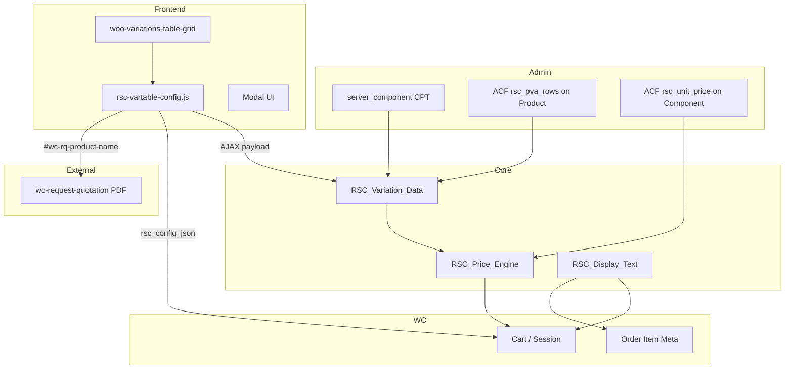
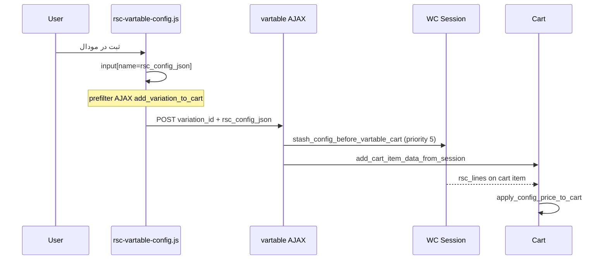

# Rasam Server Configurator — راهنمای توسعه و نگهداری

**افزونه:** `rasam-server-config`  
**نسخهٔ فعلی:** `1.8.3` (ثابت `RSC_VERSION` در `rasam-server-config.php`)  
**Text Domain:** `rasam-server-config`  
**نویسندهٔ اولیه:** AmirHossein Haidaripour  

این سند برای توسعه‌دهندگان، نگهدارندگان و تیم محتوای رسام سرور نوشته شده است تا بدون وابستگی به حافظهٔ یک نفر، بتوان افزونه را توسعه داد، باگ زد و با افزونه‌های جانبی یکپارچه نگه داشت.

---

## فهرست

1. [خلاصهٔ محصول](#خلاصهٔ-محصول)
2. [وابستگی‌ها](#وابستگی‌ها)
3. [معماری کلی](#معماری-کلی)
4. [ساختار پوشه‌ها](#ساختار-پوشه‌ها)
5. [مدل داده](#مدل-داده)
6. [قوانین کسب‌وکار](#قوانین-کسب‌وکار)
7. [موتور قیمت](#موتور-قیمت)
8. [فرانت‌اند: جدول وریشن و مودال](#فرانت‌اند-جدول-وریشن-و-مودال)
9. [سبد خرید و سفارش](#سبد-خرید-و-سفارش)
10. [قالب‌بندی متن (مودال، سبد، پیش‌فاکتور)](#قالب‌بندی-متن)
11. [یکپارچگی پیش‌فاکتور (WC Request Quotation)](#یکپارچگی-پیش‌فاکتور)
12. [فیلترهای پیشخوان](#فیلترهای-پیشخوان)
13. [AJAX و امنیت](#ajax-و-امنیت)
14. [هوک‌ها و نقاط توسعه](#هوک‌ها-و-نقاط-توسعه)
15. [استایل و دارایی‌های فرانت](#استایل-و-دارایی‌های-فرانت)
16. [ACF و Local JSON](#acf-و-local-json)
17. [کش و عملکرد](#کش-و-عملکرد)
18. [عیب‌یابی](#عیب‌یابی)
19. [چک‌لیست انتشار نسخه](#چک‌لیست-انتشار-نسخه)
20. [تاریخچهٔ تصمیم‌های مهم](#تاریخچهٔ-تصمیم‌های-مهم)

---

## خلاصهٔ محصول

افزونه به مشتری اجازه می‌دهد روی **وریشن‌های مشخص** یک محصول متغیر ووکامرس، **قطعات اضافه** (RAM، SSD، …) را از فهرست مجاز انتخاب کند. قیمت نهایی = **قیمت پایهٔ وریشن** (از ووکامرس) + **جمع قیمت قطعات انتخابی**.

| لایه | مسئولیت |
|------|---------|
| **مدیریت محتوا** | CPT قطعات، تاکسونومی نوع، ACF قیمت، ریپیتر قوانین روی محصول والد |
| **منطق** | `RSC_Variation_Data`, `RSC_Price_Engine`, `RSC_Display_Text` |
| **فرانت** | دکمه «پیکربندی» در جدول وریشن، مودال AJAX، ارسال به سبد |
| **فروش** | قیمت خط سبد، متای سفارش، نمایش خلاصه در سبد/تسویه |
| **پیش‌فاکتور** | پر کردن فیلدهای `#wc-rq-*` بدون تغییر افزونهٔ quotation |

---

## وابستگی‌ها

### الزامی (بدون آن‌ها بوت نمی‌شود)

| افزونه | مسیر bootstrap | نقش |
|--------|----------------|-----|
| **ACF Pro** | `advanced-custom-fields-pro/acf.php` | فیلدهای قطعه و ریپیتر قوانین وریشن |
| **Woo Variations Table Grid** | `woo-variations-table-grid/woo-variations-table.php` | جدول وریشن + AJAX `add_variation_to_cart` |
| **WC Request Quotation** | `wc-request-quotation/wc-request-quotation.php` | پاپ‌آپ و PDF پیش‌فاکتور |

### ضروری برای فروش

| افزونه | نقش |
|--------|-----|
| **WooCommerce** | محصول متغیر، سبد، سفارش، قیمت پایه |

### تم

- قالب فعال: **`rasamserver`** (override قالب `woocommerce/cart/cart-item-data.php` — نمایش `$data['key']` در `<dt>`؛ استایل افزونه برچسب خالی را مخفی می‌کند).

### بررسی در کد

```php
// includes/class-rsc-plugin.php
RSC_Plugin::REQUIRED_PLUGINS
```

اگر وابستگی نباشد: اعلان ادمین + `init` بدون فرانت/فیلتر ادمین.

---

## معماری کلی



### بوت

```
rasam-server-config.php
  → RSC_Plugin::instance()
    → load_dependencies()  // همیشه
    → init() @ plugins_loaded:5  // فقط اگر وابستگی OK + WC
         → RSC_Post_Types
         → RSC_Product_Allowlist_ACF
         → RSC_Frontend_Vartable
         → RSC_Admin_Filters
```

---

## ساختار پوشه‌ها

```
rasam-server-config/
├── rasam-server-config.php      # bootstrap، RSC_VERSION، constants
├── DEVELOPMENT.md               # همین سند
├── acf-json/                    # Local JSON گروه‌های ACF (منبع حقیقت فیلدها)
│   ├── group_rsc_server_component.json
│   └── group_rsc_product_allowlist.json
├── includes/
│   ├── class-rsc-plugin.php
│   ├── class-rsc-post-types.php
│   ├── class-rsc-acf.php
│   ├── class-rsc-component-data.php
│   ├── class-rsc-product-allowlist-acf.php
│   ├── class-rsc-variation-data.php
│   ├── class-rsc-display-text.php
│   ├── class-rsc-admin-filters.php
│   ├── class-rsc-frontend-vartable.php
│   └── engine/
│       └── class-rsc-price-engine.php
└── assets/
    ├── js/rsc-vartable-config.js
    └── css/
        ├── style-rsc-config.scss    # منبع استایل (ویرایش اینجا)
        ├── style-rsc-config.min.css # enqueue در production
        └── rsc-vartable-config.css  # قدیمی/جایگزین؛ enqueue اصلی min است
```

### کلاس‌ها — مرجع سریع

| کلاس | فایل | مسئولیت |
|------|------|---------|
| `RSC_Plugin` | `class-rsc-plugin.php` | بوت، وابستگی، flush rewrite |
| `RSC_Post_Types` | `class-rsc-post-types.php` | `server_component`, `server_component_type` |
| `RSC_ACF` | `class-rsc-acf.php` | مسیر load/save JSON |
| `RSC_Component_Data` | `class-rsc-component-data.php` | قیمت واحد، نوع قطعه |
| `RSC_Product_Allowlist_ACF` | `class-rsc-product-allowlist-acf.php` | UI ادمین ریپیتر |
| `RSC_Variation_Data` | `class-rsc-variation-data.php` | allowlist، فیلتر انتخاب، جمع قیمت |
| `RSC_Price_Engine` | `engine/class-rsc-price-engine.php` | جمع خطوط قطعات |
| `RSC_Display_Text` | `class-rsc-display-text.php` | قالب متن مودال/سبد/PDF |
| `RSC_Frontend_Vartable` | `class-rsc-frontend-vartable.php` | AJAX، سبد، مودال، enqueue |
| `RSC_Admin_Filters` | `class-rsc-admin-filters.php` | فیلتر لیست محصول/سفارش |

---

## مدل داده

### CPT: `server_component`

- **منو:** قطعات سرور  
- **وضعیت:** فقط `publish` در محاسبات معتبر است (`RSC_Component_Data::is_valid_component`).

### Taxonomy: `server_component_type`

- غیرسلسله‌مراتبی؛ برای **گروه‌بندی UI مودال** (مثلاً RAM، Storage).
- اولین ترم = برچسب/اسلاگ گروه در فرانت.

### فیلدهای ACF قطعه (`group_rsc_server_component`)

| نام فیلد | meta key | نوع | کاربرد |
|----------|----------|-----|--------|
| قیمت واحد | `rsc_unit_price` | number | موتور قیمت |
| کد داخلی | `rsc_internal_sku` | text | گزارش (اختیاری) |
| خانواده ارتقا | `rsc_upgrade_family` | text | آینده: swap هم‌خانواده |

### فیلدهای ACF محصول والد (`group_rsc_product_allowlist`)

| نام فیلد | meta key | نوع | کاربرد |
|----------|----------|-----|--------|
| قوانین وریشن | `rsc_pva_rows` | repeater | تعریف شخصی‌سازی |
| ↳ وریشن | `rsc_pva_variation` | post_object → `product_variation` | یک وریشن |
| ↳ قطعات | `rsc_pva_components` | relationship → `server_component` | حداقل ۱ قطعه |

**ثابت PHP:** `RSC_Variation_Data::PARENT_FIELD_ALLOWLIST_ROWS = 'rsc_pva_rows'`

> گروه ACF قدیمی روی خود وریشن (`group_rsc_variation`) **حذف شده**؛ `RSC_ACF` آن را unregister می‌کند.

### دادهٔ انتخاب کاربر (JSON)

فرمت خطوط در سبد، سشن و سفارش:

```json
[
  { "id": 123, "qty": 2 },
  { "id": 456, "qty": 1 }
]
```

| محل | کلید | توضیح |
|-----|------|--------|
| POST افزودن به سبد | `rsc_config_json` | رشتهٔ JSON از فرم/mودال |
| WC Session | `rsc_cfg_{variation_id}` | stash موقت قبل از `add_variation_to_cart` |
| Cart item | `rsc_lines` | JSON فیلترشدهٔ نهایی |
| Order item (مخفی) | `_rsc_lines_json` | همان JSON برای گزارش/ادمین |
| Order item (نمایشی) | `کانفیگ`, `قطعات اضافه` | متای قابل خواندن |

---

## قوانین کسب‌وکار

1. **فعال بودن شخصی‌سازی:** برای وریشن `V` باید در `rsc_pva_rows` محصول والد ردیفی با `rsc_pva_variation = V` و حداقل یک `rsc_pva_components` معتبر وجود داشته باشد (`is_customization_enabled`).

2. **Allowlist سخت:** هر `id` خارج از لیست مجاز هنگام ذخیره در سبد/سفارش حذف می‌شود (`filter_selection_to_allowed`).

3. **قیمت:**  
   `total = wc_variation_price + Σ (unit_price × qty)`  
   فقط برای قطعات مجاز و `qty > 0`.

4. **گروه چندخطی در UI:** اگر بیش از یک قطعه در یک `server_component_type` باشد، گروه **multi** است (تا `MAX_GROUP_SELECTION_LINES = 8` خط).

5. **اعتبارسنجی فرانت:** اگر محصول قطعهٔ قابل انتخاب دارد، برای «ثبت و افزودن» حداقل یک خط با qty > 0 لازم است (قابل تغییر در JS).

---

## موتور قیمت

**کلاس:** `RSC_Price_Engine`

```php
// نرمال‌سازی و ادغام qty برای id تکراری
$normalized = RSC_Price_Engine::normalize_lines( $raw_lines );

// فقط جمع قطعات (بدون قیمت پایه)
$parts = $engine->calculate_parts_subtotal( $normalized );
```

**ورودی خط:** `['id' => int, 'qty' => int]` یا `component_id` به‌جای `id`.

**خروجی تجمیعی:** `RSC_Variation_Data::calculate_totals( $variation_id, $lines )`:

```php
[
  'fixed'  => float,  // قیمت وریشن WC
  'parts'  => float,  // جمع قطعات
  'total'  => float,
  'engine' => RSC_Price_Engine,
]
```

---

## فرانت‌اند: جدول وریشن و مودال

### محل رندر دکمه

```php
add_action( 'woocommerce_after_add_to_cart_button', [ RSC_Frontend_Vartable, 'render_configure_button' ], 25, 2 );
```

- آرگومان دوم = `$variation` (شیء WC_Product_Variation).
- فقط اگر `variation_id` در `rscVartable.customizableIds` باشد.

### اسکریپت

- **Handle:** `rsc-vartable-config`  
- **Object سراسری:** `rscVartable` (ajaxUrl, nonce, customizableIds, productId, priceFormat, maxGroupLines, i18n)
- **وابستگی اختیاری:** `wc-rq-script` برای پیش‌فاکتور

### AJAX: `rsc_variation_config_payload`

| پارامتر | نوع | توضیح |
|---------|-----|--------|
| `action` | string | `rsc_variation_config_payload` |
| `nonce` | string | `wp_create_nonce('rsc_vartable_config')` |
| `variation_id` | int | وریشن |
| `product_id` | int | محصول والد (اختیاری) |

**پاسخ موفق (`data`):**

| کلید | توضیح |
|------|--------|
| `groups[]` | `{ key, label, multi, components[] }` |
| `fixed_price` | قیمت پایه |
| `product_title` | عنوان والد |
| `variation_name` / `variation_label` | برای قالب متن |
| `product_config_line` | خط کامل مودال |
| `variation_spec` | مشخصات وریشن بدون تکرار عنوان |

### جریان افزودن به سبد



**نکته:** `add_variation_to_cart` همهٔ فیلدهای فرم را نمی‌فرستد؛ به همین دلیل JSON ابتدا در سشن با کلید `rsc_cfg_{variation_id}` ذخیره و بلافاصله بعد از add به `rsc_lines` منتقل می‌شود.

---

## سبد خرید و سفارش

### نمایش در سبد

- فیلتر: `woocommerce_get_item_data` → `display_config_in_cart`
- HTML از `RSC_Display_Text::format_cart_meta_html`:
  - لیست قطعات (هر قطعه یک `<li>`)
  - ردیف‌های قیمت: `قیمت پایه:` و `قطعات اضافه:` چسبیده به مبلغ

### قالب تم سبد

`themes/rasamserver/woocommerce/cart/cart-item-data.php` همیشه `$data['key']` را چاپ می‌کند. افزونه:

- `key` و `name` خالی می‌فرستد
- CSS: `dt:has(+ dd .rsc-cart-meta) { display: none }`

### متای سفارش

| meta | visible | محتوا |
|------|---------|--------|
| `_rsc_lines_json` | مخفی | JSON خام |
| `کانفیگ` | بله | `build_product_config_line` |
| `قطعات اضافه` | بله | `format_parts_compact` |

---

## قالب‌بندی متن

**کلاس واحد:** `RSC_Display_Text` — هر تغییر نمایشی باید اینجا (و آینهٔ JS) متمرکز شود.

| متد | خروجی | مصرف |
|-----|--------|------|
| `get_variation_spec()` | مشخصات وریشن تمیز | پیش‌فاکتور، داخلی |
| `build_product_config_line()` | `عنوان - کانفیگ: spec` | مودال، متای سفارش |
| `format_parts_compact()` | `قطعه × n، ...` | سفارش، PDF (بخش قطعات) |
| `format_parts_cart_list_html()` | `<ul>` هر قطعه یک خط | سبد |
| `format_cart_meta_html()` | بلوک `.rsc-cart-meta` | سبد |
| `build_quotation_product_name()` | قرارداد PDF | سرور (در صورت استفاده) |

### آینهٔ JavaScript

توابع متناظر در `assets/js/rsc-vartable-config.js`:

- `getVariationSpec`, `buildProductConfigLine`, `buildPartsCompact`, `buildQuotationProductName`, `sanitizeForRqPdf`

هنگام تغییر قالب PHP، **حتماً JS را همگام کنید**.

---

## یکپارچگی پیش‌فاکتور

افزونهٔ **`wc-request-quotation` دست‌نخورده** می‌ماند. Rasam فقط فیلدهای مخفی را پر می‌کند:

| فیلد | مقدار |
|------|--------|
| `#wc-rq-product-id` | variation_id یا parent |
| `#wc-rq-product-name` | رشتهٔ قالب‌بندی‌شده (بعد از `sanitizeForRqPdf`) |
| `#wc-rq-product-price` | قیمت واحد (پایه + قطعات) |
| `#wc-rq-is-variable` | `1` اگر وریشن |

### قرارداد نام برای PDF

در `wc-request-quotation.php` خط ~586:

```php
$name_parts = explode('(', $item['name'], 2);
$product_title = trim($name_parts[0]);  // ستون «نام محصول»
$config        = rtrim(trim($name_parts[1]), ')');  // ستون «کانفیگ»
```

**فرمت ارسالی از Rasam (v1.8.3+):**

```
{عنوان محصول والد} ({مشخصات وریشن} / قطعات اضافه: {قطعه × qty, ...})
```

مثال:

```
سرور HPE ProLiant DL560 G10 (6138, Memory 256GB, SSD 8SFF / قطعات اضافه: رم سرور × 2)
```

- **ستون نام:** فقط عنوان والد  
- **ستون کانفیگ:** کانفیگ پیش‌فرض + قطعات سفارشی  

### sanitizeForRqPdf

حذف مارک‌های دوجهته (LRM/RLM/…) و یکسان‌سازی خط تیره و `|` برای جلوگیری از مربع `▯` در TCPDF/IRANYekan.

---

## فیلترهای پیشخوان

**کلاس:** `RSC_Admin_Filters`

| صفحه | query var | مقدار | معنی |
|------|-----------|-------|------|
| محصولات | `rsc_product_filter` | `customizable` | والدهایی که `rsc_pva_rows` غیرخالی دارند |
| سفارشات (legacy + HPOS) | `rsc_order_filter` | `configured` | سفارش با خط دارای `_rsc_lines_json` |

**کش:** transient `rsc_admin_parent_ids_with_customization` — ۱ ساعت؛ با `save_post_product` / `save_post_product_variation` پاک می‌شود.

---

## AJAX و امنیت

| مورد | پیاده‌سازی |
|------|------------|
| Nonce | `rsc_vartable_config` در `check_ajax_referer` داخل `ajax_config_payload` |
| Capability | payload عمومی (nopriv) — فقط دادهٔ عمومی قطعات مجاز |
| Allowlist | سمت سرور همیشه `filter_selection_to_allowed` |
| XSS | `esc_html`, `wp_kses_post` برای قیمت WC |

---

## هوک‌ها و نقاط توسعه

افزونهٔ فعلی هوک سفارشی عمومی export نکرده؛ برای توسعهٔ امن از **فیلترهای ووکامرس** استفاده کنید:

| فیلتر / اکشن | کاربرد پیشنهادی |
|--------------|-----------------|
| `woocommerce_get_item_data` | افزودن ردیف نمایشی سبد (اولویت > 10) |
| `woocommerce_add_cart_item_data` | الحاق داده (با احتیاط از تداخل `rsc_lines`) |
| `woocommerce_before_calculate_totals` | تغییر قیمت (اولویت با 20 هماهنگ شود) |
| `woocommerce_checkout_create_order_line_item` | متای اضافه روی سفارش |

**پیشنهاد برای هوک اختصاصی آینده** (در صورت نیاز تیم):

```php
// پیشنهادی — هنوز implement نشده
apply_filters( 'rsc_cart_lines_before_save', $filtered_lines, $variation_id, $cart_item_data );
apply_filters( 'rsc_quotation_product_name', $full_name, $variation_id, $lines );
```

---

## استایل و دارایی‌های فرانت

| فایل | نقش |
|------|-----|
| `style-rsc-config.scss` | منبع |
| `style-rsc-config.min.css` | **enqueue واقعی** (`RSC_VERSION` برای bust cache) |

پس از ویرایش SCSS:

1. کامپایل به `style-rsc-config.min.css` (و در صورت استفاده، `.css` + map).
2. بلوک انتهایی `.rsc-cart-meta*` در min را حذف نکنید — بخش سبد است.

**کلاس‌های مهم UI:**

- `.rsc-vt-modal`, `.rsc-vt-config-btn`, `.rsc-cart-meta`, `.rsc-cart-meta__parts-list`, `.rsc-cart-meta__price-row`

**RTL:** مودال `direction: rtl`؛ بخش لاتین پیش‌فاکتور در quotation با `dir="ltr"` رندر می‌شود.

---

## ACF و Local JSON

1. گروه‌های `group_rsc_server_component` و `group_rsc_product_allowlist` در `acf-json/` نگهداری می‌شوند.
2. `RSC_ACF::append_load_paths` مسیر افزونه را به ACF اضافه می‌کند.
3. ذخیره از UI ACF → فایل JSON داخل همین پوشه (اگر key گروه در لیست باشد).

**فرآیند تغییر فیلد:**

1. ویرایش در ادمین ACF یا مستقیم JSON  
2. هم‌نام کردن `name` با ثابت‌های PHP (`rsc_pva_rows`, `rsc_unit_price`, …)  
3. جستجوی استفاده در `RSC_Variation_Data`, `RSC_Component_Data`  
4. تست: یک محصول، یک وریشن، payload AJAX

---

## کش و عملکرد

| لایه | کلید | مدت |
|------|------|-----|
| Allowlist per request | `$allowed_ids_cache` در `RSC_Variation_Data` | همان request |
| لیست محصولات ادمین | `rsc_admin_parent_ids_with_customization` | 1 hour |

---

## عیب‌یابی

| symptom | احتمال | اقدام |
|---------|--------|--------|
| دکمه «پیکربندی» نیست | وریشن در `rsc_pva_rows` نیست | ردیف ACF روی **محصول والد** ذخیره شود |
| مودال خالی | nonce / AJAX | کنسول Network → `rsc_variation_config_payload` |
| قیمت سبد عوض نمی‌شود | `rsc_lines` خالی | بررسی سشن `rsc_cfg_*` و prefilter JS |
| `rsc_config_summary:` در سبد | کش CSS/نسخه قدیمی | Ctrl+F5؛ نسخه ≥ 1.8.1 |
| مربع در PDF | یونیکد | `sanitizeForRqPdf`؛ از `،` در مسیر RQ به `,` |
| ستون نام PDF شلوغ | فرمت نام | باید قبل از `(` فقط `product_title` باشد (≥ 1.8.3) |
| ACF Local JSON خالی | مسیر load | `RSC_ACF` قبل از `init` لود شده باشد |

### لاگ موقت (توسعه)

```php
// در filter_selection_to_allowed یا ajax_config_payload — فقط محیط dev
error_log( 'RSC lines: ' . wp_json_encode( $filtered ) );
```

---

## چک‌لیست انتشار نسخه

- [ ] افزایش `Version` در header و `RSC_VERSION`
- [ ] کامپایل `style-rsc-config.min.css` در صورت تغییر SCSS
- [ ] تست: مودال → سبد → تسویه → ثبت سفارش → متای سفارش
- [ ] تست: پیش‌فاکتور PDF (ستون نام / کانفیگ)
- [ ] تست: فیلتر ادمین محصول و سفارش
- [ ] `delete_transient('rsc_admin_parent_ids_with_customization')` پس از تغییرات دسته‌ای ACF (در صورت نیاز)
- [ ] بررسی سه افزونهٔ وابسته روی staging

---

## تاریخچهٔ تصمیم‌های مهم

| تصمیم | دلیل |
|-------|------|
| قوانین روی **محصول والد** نه وریشن | مدیریت متمرکز؛ جلوگیری از پراکندگی meta |
| Session stash برای `rsc_config_json` | محدودیت payload در `add_variation_to_cart` |
| عدم ویرایش `wc-request-quotation` | پایداری آپدیت افزونهٔ شخص ثالث |
| قرارداد `(` برای PDF | رفتار موجود quotation |
| `RSC_Display_Text` متمرکز | یک منبع برای مودال/سبد/PDF |
| enqueue `min.css` | عملکرد؛ SCSS منبع نگهداری |

---

## تماس و مالکیت

برای تغییرات بزرگ (خانواده ارتقا، چند وریشن در یک سفارش، API خارجی) ابتدا این سند و `RSC_Variation_Data` را به‌روز کنید، سپس PR داخلی با چک‌لیست بالا.

**مسیر افزونه در مخزن پروژه:**

`wp-content/plugins/rasam-server-config/`

---

*آخرین به‌روزرسانی سند: هم‌تراز با افزونه نسخه 1.8.3*
